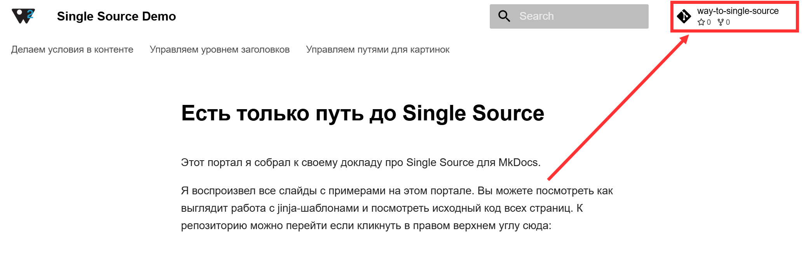

# Есть только путь до Single Source

Этот портал я собрал к своему докладу про Single Source на конференции   **TechWriter Days 2**. 

Я воспроизвел все слайды с примерами на этом портале. Вы можете посмотреть как выглядит работа с jinja-шаблонами и посмотреть исходный код всех страниц. К репозиторию можно перейти если кликнуть в правом верхнем углу сюда:

Там же в репозитории находится **.gitlab-ci.yml**, который можно использовать для передачи jinja-шаблонов между репозиториями.